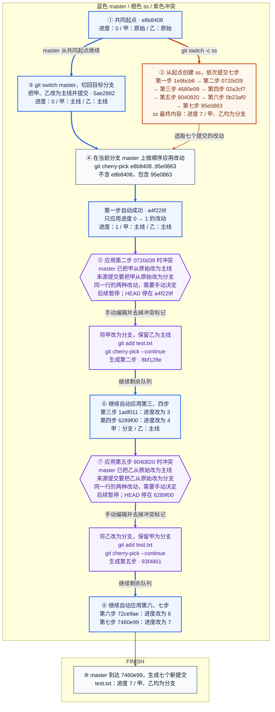

| 提交说明 | ss 原提交 | master 新提交 | 这一步的改动 | 主线应用后的内容：进度 / 甲 / 乙 |
| --- | --- | --- | --- | --- |
| 第一步 | `1e9bcb6` | `a4f229f` | 进度 0 → 1，自动成功 | 1 / 主线 / 主线 |
| 第二步 | `0720d39` | `8bf128e` | 来源改动是甲「原始 → 分支」；主线已是「主线」，冲突后选择「分支」 | 1 / 分支 / 主线 |
| 第三步 | `4680e99` | `1adf011` | 进度 1 → 3，自动成功 | 3 / 分支 / 主线 |
| 第四步 | `02a3cf7` | `6289f00` | 进度 3 → 4，自动成功 | 4 / 分支 / 主线 |
| 第五步 | `9040820` | `93f4861` | 来源改动是乙「原始 → 分支」；主线已是「主线」，冲突后选择「分支」 | 4 / 分支 / 分支 |
| 第六步 | `0b23af0` | `72ce9ae` | 进度 4 → 6，自动成功 | 6 / 分支 / 分支 |
| 第七步 | `95e0863` | `7460e99` | 进度 6 → 7，自动成功 | 7 / 分支 / 分支 |

| 容易混淆的操作 | 本例中的行为 |
| --- | --- |
| `git cherry-pick 95e0863` | 只挑选第七步；要选所有的七步，使用图中的 `e8b8408..95e0863` 范围命令 |
| 冲突解决后：`git add test.txt` → `git cherry-pick --continue` | 完成当前提交，并继续后面的队列；本次在第二步、第五步各执行一次 |
| 冲突时：`git cherry-pick --skip` | 放弃当前卡住的提交，继续后面的队列；本次未使用 |
| 冲突时：`git cherry-pick --abort` | 撤销当前整次操作；若用图中的一次范围命令启动，会回到 `5ae2882`；本次未使用 |
