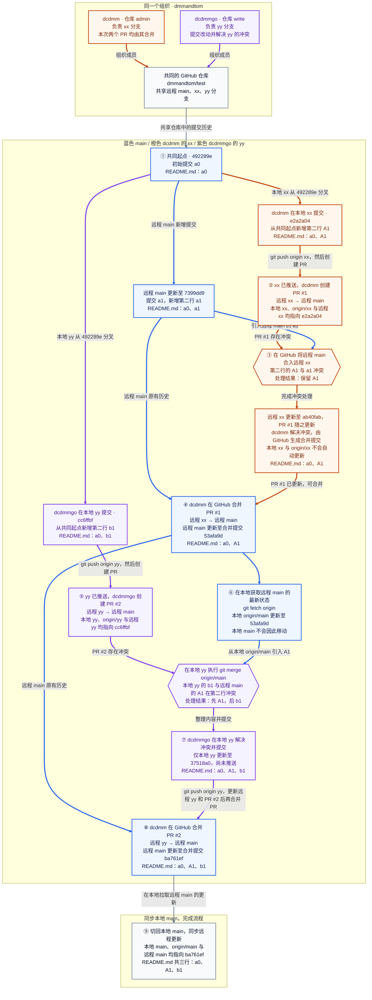

| 步骤 | 成员与操作位置 | 做了什么 | 完成后的状态 |
| --- | --- | --- | --- |
| 协作背景 | 两人同属 `dmmandtom` 组织，共用仓库 `dmmandtom/test`；`dcdmm` 为 admin（管理员），负责 xx；`dcdmmgo` 为 write（写入权限），负责 yy | 远程 main 的规则已启用：限制更新、限制删除、阻止强推；绕过列表中的 Repository admin 设为 Always allow（始终允许绕过） | 各自在本地分支开发并推送，由 dcdmm 在 GitHub 合并 PR 到远程 main |
| ① 从同一起点分别开发 | 远程 main；`dcdmm / 本地 xx`；`dcdmmgo / 本地 yy` | 初始提交 `492289e` 只有 a0；远程 main 新增提交 `7399dd9`，添加 a1；本地 xx 的 `e2a2a04` 添加 A1，本地 yy 的 `cc6ffbf` 添加 b1 | 这三个新增提交的父提交都是 `492289e`；本地 xx 和 yy 都从 `492289e` 分叉，没有包含远程 main 的 `7399dd9` |
| ② 推送 xx 并创建 PR #1 | `dcdmm` 在本地推送 xx，在 GitHub 创建 PR | 执行 `git push origin xx`，创建 [PR #1](https://github.com/dmmandtom/test/pull/1)：远程 xx → 远程 main | 本地 xx、origin/xx 与远程 xx 均指向 `e2a2a04`；远程 xx 的 A1 与远程 main 的 a1 冲突。PR 尚未合并，远程 main 仍指向 `7399dd9` |
| ③ 将远程 main 合入远程 xx，解决第一次冲突 | `dcdmm` 在 GitHub 处理远程 xx 的冲突 | 将远程 main 的 `7399dd9` 合入远程 xx 的 `e2a2a04`；dcdmm 解决第二行的冲突并保留 A1，由 GitHub 生成合并提交 `ab40fab` | 远程 xx 更新至 `ab40fab`，README.md 内容为 a0、A1，PR #1 随之更新；远程 main 仍指向 `7399dd9`。本地 xx 和 origin/xx 不会因 GitHub 上的操作自动更新 |
| ④ 管理员合并 PR #1 | `dcdmm` 在 GitHub 合并 [PR #1](https://github.com/dmmandtom/test/pull/1) | 将远程 xx 的 `ab40fab` 合入远程 main，生成合并提交 `53afa9d` | 远程 main 更新至 `53afa9d`，README.md 内容为 a0、A1；`53afa9d` 与 `ab40fab` 的文件树相同，远程 xx 仍指向 `ab40fab`。两人的本地 main 和 origin/main，以及 dcdmmgo 的本地 yy，都不会因 PR 合并自动更新 |
| ⑤ 推送 yy 并创建 PR #2 | `dcdmmgo` 在本地推送 yy，在 GitHub 创建 PR | 执行 `git push origin yy`，创建 [PR #2](https://github.com/dmmandtom/test/pull/2)：远程 yy → 远程 main | 本地 yy、origin/yy 与远程 yy 均指向 `cc6ffbf`；远程 yy 的 b1 与远程 main 的 A1 冲突。PR 尚未合并，远程 main 仍指向 `53afa9d` |
| ⑥ 在本地 yy 开始合并远程 main 的更新 | `dcdmmgo / 本地 yy` | 执行 `git switch yy` → `git fetch origin` → `git merge origin/main`，通过本地 origin/main 将远程 main 的 `53afa9d` 合入本地 yy | fetch 将本地 origin/main 更新至 `53afa9d`，不会移动本地 main；随后合并时，第二行的 A1 与 b1 冲突。解决冲突并提交前，本地 yy 仍指向 `cc6ffbf`；远程 yy 也尚未改变 |
| ⑦ 本地 yy 解决冲突并推送，更新 PR #2 | `dcdmmgo / 本地 yy`；推送至远程 yy | 将 README.md 整理为 a0、A1、b1 三行，提交生成 `37518a0`；再执行 `git push origin yy`，更新已有的 PR #2 | 提交后仅本地 yy 更新至 `37518a0`；推送后，本地 yy、origin/yy 与远程 yy 才均指向 `37518a0`，PR #2 自动更新。远程 main 与本地 origin/main 仍指向 `53afa9d` |
| ⑧ 管理员合并 PR #2 | `dcdmm` 在 GitHub 合并 [PR #2](https://github.com/dmmandtom/test/pull/2) | 将远程 yy 的 `37518a0` 合入远程 main，生成合并提交 `ba761ef`；PR 描述为“第二行修改为 b1”，合并后的实际结果是在 A1 后新增第三行 b1 | 远程 main 更新至 `ba761ef`，README.md 内容为 a0、A1、b1；`ba761ef` 与 `37518a0` 的文件树相同，远程 yy 仍指向 `37518a0`。两人的本地 main 和 origin/main 均需另行同步 |
| ⑨ 同步本地主分支，完成流程 | 需要同步的本地仓库 / 本地 main | 切回本地 main，拉取远程 main 的更新 | 同步后，该本地仓库的 main、origin/main 与远程 main 均指向 `ba761ef`，README.md 内容为 a0、A1、b1；另一名成员的本地仓库需自行同步 |
