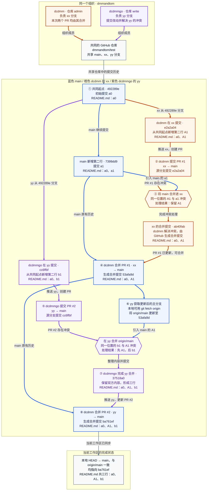

| 步骤 | 成员与操作位置 | 做了什么 | 完成后的状态 |
| --- | --- | --- | --- |
| 协作背景 | 两人同属 `dmmandtom` 组织，共用仓库 `dmmandtom/test`；`dcdmm` 为 admin（管理员），负责 xx；`dcdmmgo` 为 write（写入权限），负责 yy | main 的规则已启用：限制更新、限制删除、阻止强推；绕过列表中的 Repository admin 设为 Always allow（始终允许绕过） | 各自在分支开发，由 dcdmm 合并 PR 到 main |
| ① 从同一起点分别开发 | `main`；`dcdmm / xx`；`dcdmmgo / yy` | 初始提交 `492289e` 只有 a0；main 的 `7399dd9` 添加 a1，xx 的 `e2a2a04` 添加 A1，yy 的 `cc6ffbf` 添加 b1 | 三个普通提交的父提交都是 `492289e`；xx 和 yy 都没有以 `7399dd9` 为起点 |
| ② xx 推送并提交 PR #1 | `dcdmm / xx`；GitHub | 推送 xx 的 `e2a2a04`，于 2026-09-21 11:07:04（UTC+8）创建 [PR #1](https://github.com/dmmandtom/test/pull/1)：xx → main | PR 已创建，尚未合并；xx 的 A1 与 main 的 a1 冲突，main 仍在 `7399dd9` |
| ③ main 合入 xx，处理第一次冲突 | `dcdmm / xx`；合并提交的提交者为 GitHub | 将 main 的 `7399dd9` 合入 xx 的 `e2a2a04`，同一位置的 A1 与 a1 冲突；结果选择 A1，形成 `ab40fab` | xx 为 a0、A1，PR #1 随源分支更新；main 尚未改变 |
| ④ 管理员合并 PR #1 | `dcdmm` 在 GitHub 合并 [PR #1](https://github.com/dmmandtom/test/pull/1) | 将 xx 的 `ab40fab` 合入 main，生成 `53afa9d` | main 为 a0、A1；`53afa9d` 与 `ab40fab` 的文件树相同；yy 原有提交仍只有 a0、b1 |
| ⑤ yy 推送并提交 PR #2 | `dcdmmgo / yy`；GitHub | 推送 yy 的 `cc6ffbf`，于 2026-09-21 11:11:04（UTC+8）创建 [PR #2](https://github.com/dmmandtom/test/pull/2)：yy → main | PR 已创建，尚未合并；yy 的 b1 与 main 的 A1 冲突，main 仍在 `53afa9d` |
| ⑥ yy 获取主分支并开始合并 | `dcdmmgo / 本地 yy` | `git switch yy` → `git fetch origin` → `git merge origin/main`，目标为 `53afa9d` | fetch 更新本地远程跟踪引用 origin/main；合并时 A1 与 b1 冲突，等待解决 |
| ⑦ yy 解决冲突并更新 PR #2 | `dcdmmgo / yy` | 将 README 整理为 a0、A1、b1，形成合并提交 `37518a0`；执行 `git push origin yy`，更新已有的 PR #2 | yy 为 a0、A1、b1，PR #2 随源分支更新；main 仍在 `53afa9d` |
| ⑧ 管理员合并 PR #2 | `dcdmm` 在 GitHub 合并 [PR #2](https://github.com/dmmandtom/test/pull/2) | 将 yy 的 `37518a0` 合入 main，生成 `ba761ef`；PR 描述为“第二行修改为 b1”，实际是在 A1 后新增第三行 b1 | main 为 a0、A1、b1；`ba761ef` 与 `37518a0` 的文件树相同 |
