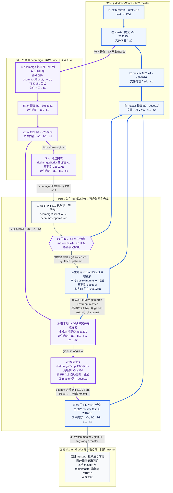

| 步骤 | 在哪里操作 | 做了什么 | 完成后的状态 |
| --- | --- | --- | --- |
| ① 主仓库开发 | `dcdmm/Script:master` | 从 `6e95e33` 的空文件开始，依次提交 a0、a1、a2 | master 到达 `eecee1f`，文件内容为 a0、a1、a2 |
| ② Fork 并开发 xx | 贡献者的 Fork：`dcdmmgo/Script` | Fork 项目；xx 从 `734215c` 分出，依次提交 b0、b1 | xx 到达 `926027a`，文件内容为 a0、b0、b1 |
| ③ 推送 xx 到自己的仓库 | dcdmmgo 的本地 xx | 执行 `git push -u origin xx`，推送到 `dcdmmgo/Script` | 远程 xx 指向 `926027a`；主仓库 master 尚未接收 b0、b1 |
| ④ 创建 PR #19 | GitHub | `dcdmmgo` 创建 [PR #19](https://github.com/dcdmm/Script/pull/19)：`dcdmmgo/Script:xx` → `dcdmm/Script:master` | 两边在 a0 后追加了不同内容，PR 有冲突，暂时不能合并 |
| ⑤ 获取更新、解决冲突并推送 | 贡献者本地 xx | `git switch xx` → `git fetch upstream` → `git merge upstream/master` 编辑 test.txt，删除冲突标记，保留 a0、b0、b1、a1、a2 五行 执行 `git add test.txt` → `git commit` → `git push origin xx` | `upstream/master` 是本地保存的主仓库 master 位置记录；fetch 将它更新到 `eecee1f`，不会修改 xx 的文件；merge 才把这个提交合入 xx。解决冲突后生成 `a6ca320`，父提交依次为 `926027a`、`eecee1f`；推送后原 PR 自动更新，主仓库 master 仍在 `eecee1f` |
| ⑥ 将 xx 的 PR 合入主仓库 | GitHub，`dcdmm/Script:master` | `dcdmm` 合并原 PR #19：Fork 的 xx → 主仓库 master | master 更新到 `7f10e1d`，父提交依次为 `eecee1f`、`a6ca320`；文件内容为 a0、b0、b1、a1、a2；Fork 的远程 xx 仍在 `a6ca320` |