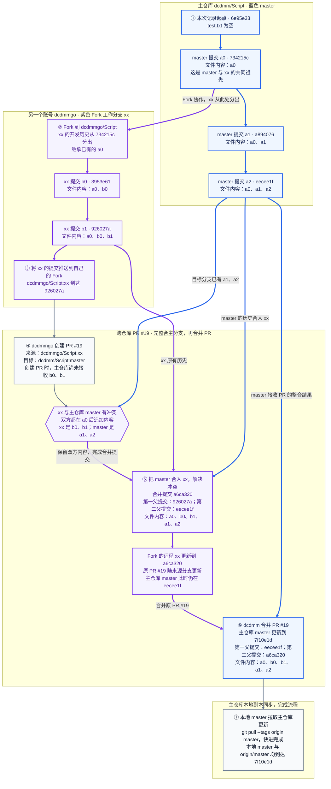

# 跨账号 Fork → 提交 PR → 合并回主仓库

本图记录从 `6e95e337dc74ab735d4bd3b096a8ff3492a9dfa8` 到 `7f10e1ddcb86da06007fdafbaddc1fd6493aa2eb` 的实际流程。核对时，后者是本地 `master`、`origin/master` 和 GitHub 主仓库 `master` 的最新提交。

主仓库是 [dcdmm/Script](https://github.com/dcdmm/Script)，另一个账号的 Fork 是 [dcdmmgo/Script](https://github.com/dcdmmgo/Script)。跨仓库的 [PR #19：添加b0,b1](https://github.com/dcdmm/Script/pull/19) 由 `dcdmmgo` 创建，方向为 **`dcdmmgo/Script:xx` → `dcdmm/Script:master`**，最后由 `dcdmm` 合并。



| 步骤 | 在哪里操作 | 做了什么 | 完成后的状态 |
| --- | --- | --- | --- |
| ① 主仓库开发 | `dcdmm/Script:master` | 从 `6e95e33` 的空文件开始，依次提交 a0、a1、a2 | 主分支到达 `eecee1f`，文件内容为 a0、a1、a2 |
| ② 另一个账号 Fork 并开发 | `dcdmmgo/Script` 的 `xx` 分支 | Fork 项目；xx 的历史从 `734215c` 分出，依次提交 b0、b1 | xx 到达 `926027a`，文件内容为 a0、b0、b1；分叉点是 a0 提交，而不是空文件起点 `6e95e33` |
| ③ 推送到 Fork | 贡献者本地 → `dcdmmgo/Script:xx` | 将工作分支推送到自己账号下的仓库 | Fork 的 xx 包含 b0、b1，主仓库 master 尚未接收这些改动 |
| ④ 创建跨仓库 PR | 主仓库的 GitHub PR 页面 | `dcdmmgo` 创建 [PR #19](https://github.com/dcdmm/Script/pull/19)，来源选自己的 `xx`，目标选主仓库的 `master` | PR 建立两个仓库分支之间的合并请求；两边在 a0 后的追加内容有冲突 |
| ⑤ 先在 xx 整合主分支 | 贡献者的 `xx` 分支 | 将 `eecee1f` 合入 `926027a`，解决冲突，生成 `a6ca320`，并使 Fork 远程 xx 接收结果 | xx 内容变成 a0、b0、b1、a1、a2；原 PR 随之更新；主仓库 master 仍是 `eecee1f` |
| ⑥ 再把 PR 合回主仓库 | GitHub，`dcdmm/Script:master` | `dcdmm` 合并 PR #19，生成 `7f10e1d` | 主仓库正式包含 b0、b1；PR 合并时的来源分支头为 `a6ca320`，不会因目标分支的合并操作自动变成 `7f10e1d` |
| ⑦ 同步主仓库本地副本 | 当前本地仓库的 `master` | reflog 记录为 `pull --tags origin master: Fast-forward` | 本地 master、origin/master 和核对时的主仓库远程 master 均为 `7f10e1d` |

这里有两次方向相反的合并：`a6ca320` 是 **主仓库 master → Fork 的 xx**，用于解决冲突；`7f10e1d` 是 **Fork 的 xx → 主仓库 master**，用于完成 PR。最终 `test.txt` 的行顺序是：

```text
a0
b0
b1
a1
a2
```

核对依据：Git 提交父子关系、各提交的 `test.txt`、当前本地 reflog、远程 master 引用，以及 PR #19 的来源仓库、分支与合并状态。Fork 的具体操作时刻无法仅凭提交历史确认，图中 Fork 节点用于说明仓库关系和 xx 的实际分叉点；冲突处理发生在本地还是 GitHub 网页也未作断言。

远程名取决于本地副本：当前仓库的 `origin` 指向 `dcdmm/Script`；贡献者若克隆自己的 Fork，通常会把 `origin` 指向 `dcdmmgo/Script`，另用 `upstream` 指向主仓库。这是命名惯例，贡献者本地的实际远程配置不在本次可核对记录中。
