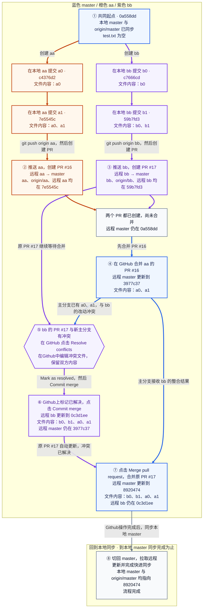

| 步骤 | 在哪里操作 | 做了什么 | 完成后的状态 |
| --- | --- | --- | --- |
| ① 从同一起点分别开发 | 本地 aa、bb | 从 `0a558dd2a578f3c0b5537e1f87c830c015f29118` 创建 aa、bb，各提交两次；| aa 到 `7e5545c`，内容为 a0、a1；bb 到 `59b7fd3`，内容为 b0、b1 |
| ② 创建 aa 的 PR | 本地推送；GitHub 创建 PR | 推送 aa，创建 [PR #16](https://github.com/dcdmm/Script/pull/16)：远程 aa → master | aa、origin/aa 与远程 aa 均在 `7e5545c`；主分支尚未改变 |
| ③ 创建 bb 的 PR | 本地推送；GitHub 创建 PR | 推送 bb，创建 [PR #17](https://github.com/dcdmm/Script/pull/17)：远程 bb → master | bb、origin/bb 与远程 bb 均在 `59b7fd3`；两个 PR 都已创建，远程 master 仍在 `0a558dd` |
| ④ 合并 aa 的 PR | GitHub | 合并 PR #16 | 远程 master 更新到 `3977c37`，包含 a0、a1；bb 的 PR #17 与更新后的主分支有冲突 |
| ⑤ 在Github处理冲突 | GitHub 的 PR #17 页面 | 点击 `Resolve conflicts`，编辑冲突文件，保留 b0、b1、a0、a1，去掉冲突标记 | 在Github中确定合并结果；此时尚未将 bb 的 PR 合入 master |
| ⑥ 保存Github上的冲突解决结果 | GitHub 的远程 bb | 点击 `Mark as resolved`，再点击 `Commit merge`，将远程 master 合入远程 bb | GitHub 生成 `0c3d1ee`，远程 bb 更新，原 PR #17 自动更新；远程 master 仍在 `3977c37`。本地 bb 和 origin/bb 仍在 `59b7fd3`，不会自动同步 |
| ⑦ 合并 bb 原来的 PR | GitHub | 点击 `Merge pull request`，完成 PR #17 的合并 | 远程 master 更新到 `8920474`，包含双方内容；远程 bb 仍在 `0c3d1ee`。这一步才把 bb 的整合结果放入主分支 |
| ⑧ 同步本地主分支，完成流程 | 本地 master | 切回 master，拉取远程更新，完成快进同步； | 本地 master 与 origin/master 都指向 `8920474`，不产生新提交 |
