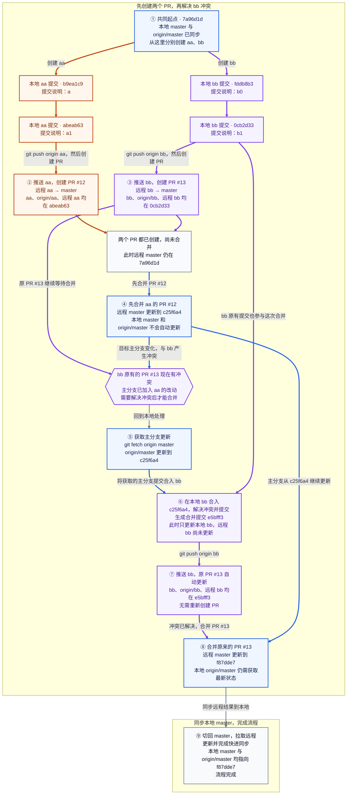

| 步骤 | 在哪里操作 | 做了什么 | 结果与分支状态 |
| --- | --- | --- | --- |
| ① 共同起点，分别开发 | 本地 aa、bb | 从 `7a96d1dee55a8c711000873247550d1421318fd7` 创建 aa、bb，各提交两次 | aa 到 `abeab63`，bb 到 `0cb2d33`；两边尚未互相合并 |
| ② 创建 aa 的 PR | 本地推送；GitHub 创建 PR | 推送 aa，创建 [PR #12](https://github.com/dcdmm/Script/pull/12)：远程 aa → master | aa、origin/aa 与远程 aa 均在 `abeab63`；创建 PR 不会修改主分支 |
| ③ 创建 bb 的 PR | 本地推送；GitHub 创建 PR | 推送 bb，创建 [PR #13](https://github.com/dcdmm/Script/pull/13)：远程 bb → master | bb、origin/bb 与远程 bb 均在 `0cb2d33`；此时 PR #12 也尚未合并，目标主分支仍在 `7a96d1d` |
| ④ 合并 aa | GitHub | 合并 PR #12，生成 `c25f6a4` | 远程 master 已包含 aa 的改动；原 PR #13 与更新后的主分支有冲突；本地引用不会自动更新 |
| ⑤ 获取最新主分支 | 本地 | 获取记录显示执行过 `git fetch origin master` | origin/master 更新到 `c25f6a4`；本地 master 仍在 `7a96d1d`，工作分支尚未因此合并 |
| ⑥ 解决冲突并提交 | 本地 bb | 将获取的主分支提交 `c25f6a4` 合入 bb，处理冲突并完成提交 | 生成 `e5bfff3`；两个父提交是 bb 原来的 `0cb2d33` 和主分支的 `c25f6a4`；此时远程 bb 和 origin/bb 尚未接收新提交 |
| ⑦ 更新已有 PR | 本地推送；GitHub 自动更新 PR | 推送 bb 的合并提交 | bb、origin/bb 与远程 bb 均在 `e5bfff3`；原 PR #13 自动包含新提交，无需再建 PR |
| ⑧ 合并 bb | GitHub | 合并原 PR #13，生成 `f87dde7` | 远程 master 接收 bb 的整合结果；远程 aa 仍在 `abeab63`，远程 bb 仍在 `e5bfff3` |
| ⑨ 同步本地主分支，完成流程 | 本地 master | 切回 master，拉取远程更新，完成快进同步 | 本地 master 与 origin/master 都指向 `f87dde7`，不产生新提交 |
