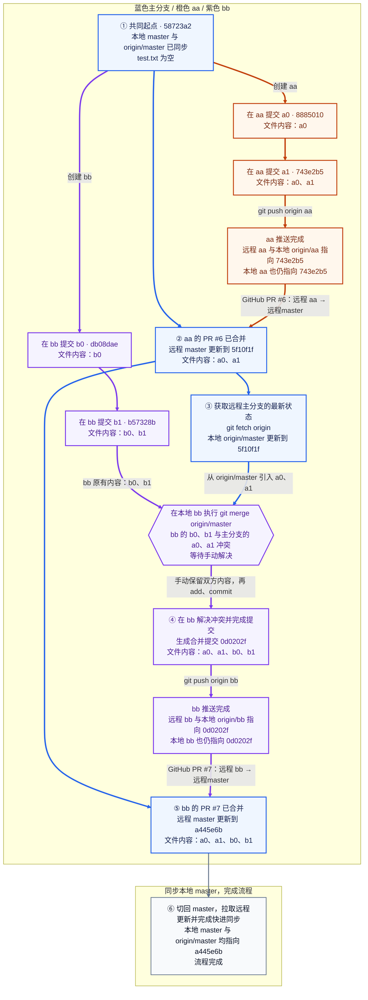

| 步骤 | 在哪里操作 | 做了什么 | 完成后的状态 |
| --- | --- | --- | --- |
| ① 从同一起点分别开发 | 本地 aa、bb | 从 `58723a2` 创建两个分支，分别修改、提交 | aa 有 a0、a1；bb 有 b0、b1；主分支仍在起点 |
| ② aa 通过 PR 进入主分支 | 本地推送 aa；GitHub 合并 PR | `git push origin aa`，创建并合并 [PR #6](https://github.com/dcdmm/Script/pull/6)：远程 aa → master | 推送后 aa、origin/aa 和远程 aa 均在 `743e2b5`；PR 合并只把远程 master 更新到 `5f10f1f`，本地 master、origin/master 和 bb 不会因此自动更新 |
| ③ 在 bb 同步主分支，遇到冲突 | 本地 bb | `git switch bb` → `git fetch origin` → `git merge origin/master` | fetch 将 origin/master 更新到 `5f10f1f`，不移动本地 master；合并时双方在同一位置添加不同内容，出现冲突，等待解决 |
| ④ 解决冲突并提交 | 本地 bb | 将文件整理成 a0、a1、b0、b1，去掉冲突标记，执行 `git add test.txt` 和 `git commit` | 仅本地 bb 更新到 `0d0202f`；origin/bb 和远程 bb 尚未接收此提交；origin/master 与远程 master 仍在 `5f10f1f` |
| ⑤ bb 通过 PR 进入主分支 | 本地推送 bb；GitHub 合并 PR | `git push origin bb`，创建并合并 [PR #7](https://github.com/dcdmm/Script/pull/7)：远程 bb → master | 推送后 bb、origin/bb 和远程 bb 均在 `0d0202f`；PR 合并把远程 master 更新到 `a445e6b`，本地 origin/master 仍需获取更新 |
| ⑥ 同步本地主分支，完成流程 | 本地 master | 切回 master，拉取远程更新，完成快进同步 | 本地 master 与 origin/master 都指向 `a445e6b`，不产生新提交 |
