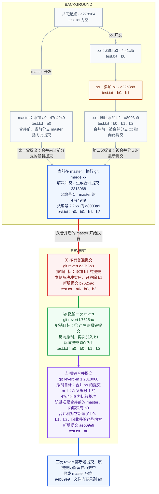

| 对比项 | ① 撤销普通提交 | ② 撤销一次 revert | ③ 撤销合并提交 |
| --- | --- | --- | --- |
| 撤销目标 | `c22b8b8`：添加 b1 | `b7625ac`：第①步产生的撤销提交 | `2318068`：合并 xx |
| 命令 | `git revert c22b8b8` | `git revert b7625ac` | `git revert -m 1 2318068` |
| 父提交的含义 | — | — | 本次在 master 执行 `git merge xx`：第一父提交是合并前 master 的 `47e4949`；第二父提交是被合并的 xx 的 `a8003a9`。编号由本次合并方向决定，与提交时间先后无关 |
| 本次改动 | 移除 b1，保留 a0、b0 和后续添加的 b2 | 反向撤销第①步，重新加入 b1 | 撤销合并相对第一父提交引入的改动，移除 b0、b1、b2 |
| 执行前的 test.txt | a0、b0、b1、b2 | a0、b0、b2 | a0、b0、b1、b2 |
| 执行后的 test.txt | a0、b0、b2 | a0、b0、b1、b2 | a0 |
| 新增提交 | `b7625ac` | `0f0c7cb` | `aeb69e9` |
| 操作要点 | 本例有冲突；整理为 a0、b0、b2，执行 `git add test.txt`、`git revert --continue` | 目标是撤销提交 `b7625ac`，从而恢复 b1 | `-m 1` 中的 `1` 是父提交编号：以合并前 master 的 `47e4949`（只有 a0）为比较基准，撤销合并相对它新增的 b0、b1、b2 |
| 历史变化 | 原提交 `c22b8b8` 仍保留 | 原撤销提交 `b7625ac` 仍保留 | 原合并提交 `2318068` 仍保留，master 向前更新到 `aeb69e9` |
